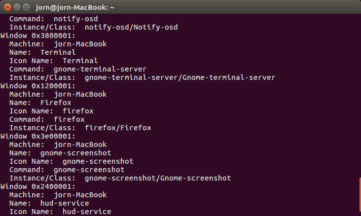

# showing-open-windows-in-travis

The window managers

*wmctrl is only compatible with EWMH- and NetWM-compatible X Window window manager*

*you could also use xlsclients, it works on the terminal*

window manager | tested
---|---
xfwm4|yes, failed
i3|yes, failed
wmaker|yes, failed
awesome|yes, failed
matchbox|yes, failed
wmii|no, TODO
dwn|no, TODO
stumpWM|no, TODO
xmonad|no, TODO

how to set up window managers with travis:

